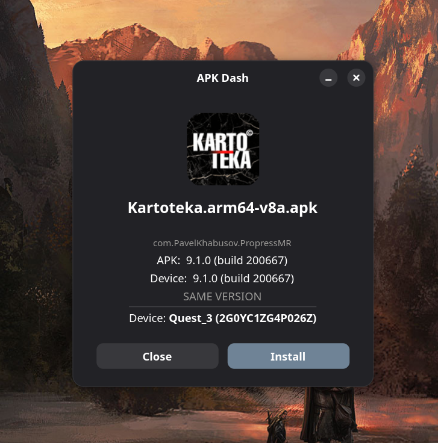
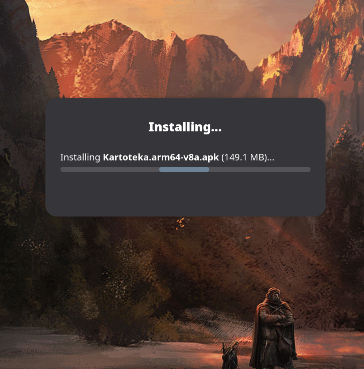
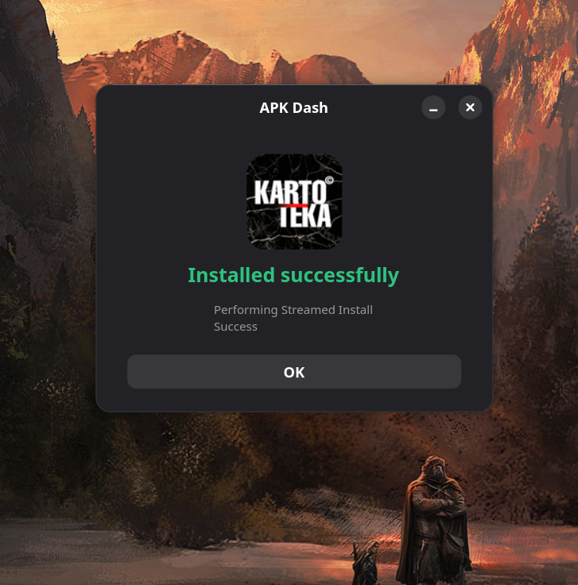

# APK Dash


> Right-click any APK in Nautilus — instantly see version info, compare with what's on your device, and install in one click.

A lightweight Nautilus script that turns GNOME Files into an Android developer's best friend. No Android Studio, no terminal, no `aapt` — just right-click and go.

## What it does

- **Version at a glance** — shows `versionName` and `versionCode` right from the context menu
- **Smart comparison** — detects UPGRADE / DOWNGRADE / SAME VERSION vs what's installed on device
- **One-click install** — pushes APK via ADB with progress indicator
- **App icon preview** — extracts and renders the icon with rounded corners
- **Multi-device support** — pick which device to install to when multiple are connected
- **Zero dependencies on Android SDK** — parses `AndroidManifest.xml` and `resources.arsc` binary formats natively in Python

## Screenshots

| Info | Loading | Install result |
|------|---------|----------------|
|  |  |  |

## Install

### Requirements

- GNOME with Nautilus
- Python 3 + GTK4/libadwaita bindings (`python-gobject`)
- Pillow (`python-pillow`)
- `adb` for device features (`android-tools` on Arch)

#### Arch Linux (one-liner)

```bash
sudo pacman -S python-gobject python-pillow android-tools
```

### Setup

```bash
cp "APK Dash" ~/.local/share/nautilus/scripts/
chmod +x ~/.local/share/nautilus/scripts/"APK Dash"
```

Restart Nautilus if needed:

```bash
nautilus -q
```

## Usage

1. Right-click an `.apk` file in Nautilus
2. **Scripts** → **APK Dash**
3. See version info and comparison with the installed version
4. Hit **Install** to push to device via ADB
